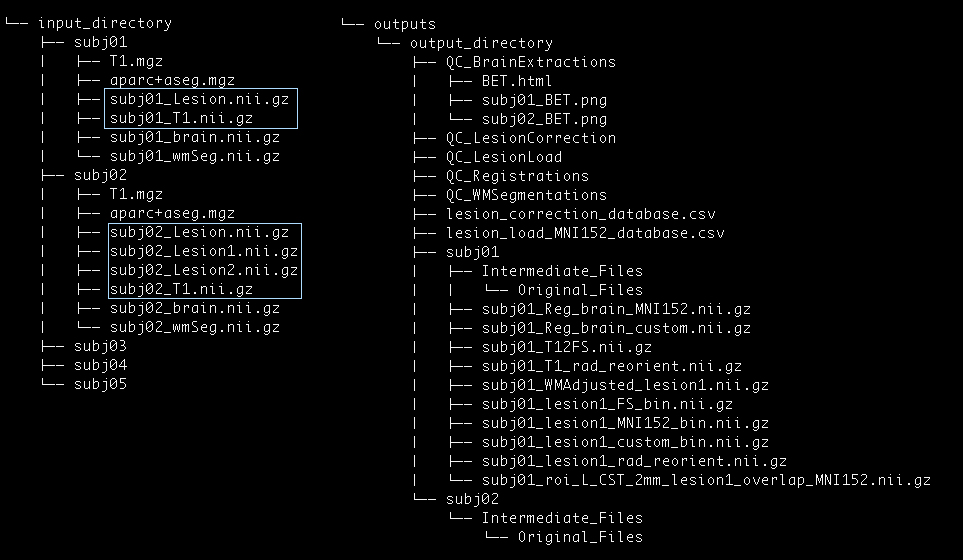

# Pipeline for Analyzing Lesions after Stroke (PALS) #


Welcome to our github page!

This page is under construction. Please use under your own discretion.

## What is PALS?

PALS is a scalable and user-friendly toolbox designed to facilitate standardized analysis and ensure quality in stroke research using T1-weighted MRIs. The PALS toolbox offers four moduels integrated into a single pipeline, including (1) reorientation to radiological convention, (2) lesion correction for healthy white matter voxels, (3) lesion load calculation, and (4) visual quality control.


## Getting Started

### Prerequisites

* Linux or Mac OS

* [Python 2.7](https://www.python.org/download/releases/2.7/)

* [FSL](https://fsl.fmrib.ox.ac.uk/fsl/fslwiki/FslInstallation)

* [FSLeyes](https://fsl.fmrib.ox.ac.uk/fsl/fslwiki/FSLeyes)

  Separate installation of FSLeyes is necessary only if a version of FSL older than 5.0.10 is installed.

For first-time users, PALS will ask for the directory path to FSL binaries.

<!-- ```
Give examples
``` -->

### Install:

Clone this github repository:

```
git clone https://github.com/npnl/PALS.git

```

Install python dependencies
```
cd PALS
pip install -r requirements.txt
```
---

## Run:
To use PALS, the user must first use a method of their choice to generate initial lesion masks for their dataset.

### Data Structure



#### Input Files
PALS requires the user to provide an Input Directory with separate Subject Directories containing:

* Subject's T1-weighted anatomical image file (nifti)
* Subject's lesion mask file (nifti)

Optional Inputs:
* Subject's skull-stripped brain file (nifti)
* Subject's white matter segmentation file (nifti)
* Subject's FreeSurfer T1 file (T1.mgz)
* Subject's FreeSurfer cortical/subcortical parcellation file (aparc+aseg.mgz)

#### Output files

[ coming soon ]

### Instructions

Open up your terminal and navigate to the directory containing PALS source code.

```
cd /PATH/TO/PALS
python2.7 run_pals.py

```
This will open up the PALS GUI.

---
### Support

The best way to keep track of bugs or failures is to open a New Issue on the Github system. You can also contact the author via email: kaoriito at usc dot edu.

---

### Authors

* **Kaori Ito** - [Github](https://github.com/kaoriito)
* **Amit Kumar** - [Github](https://github.com/amitasviper)


### License

This project is licensed under the MIT License - see the [LICENSE.md](LICENSE.md) file for details

<!-- ## Acknowledgments

* Hat tip to anyone who's code was used
* Inspiration
* etc -->
